# 🤖 AI-Powered Browser Automation Agent

> Transform natural language commands into automated web interactions using AI and Playwright

## 🚀 Overview
An intelligent browser automation system that converts natural language commands like *"Search for laptops on Amazon"* into executable browser actions with human-like behavior and anti-detection measures.


## ✨ Key Features
- 🧠 **AI-Powered Command Processing** - OpenAI GPT for natural language understanding
- 🎯 **Hybrid Action Mapping** - Site-specific selectors + AI fallbacks
- 🕵️ **Anti-Detection Measures** - Human-like behavior simulation
- 📸 **Visual Feedback** - Screenshot capture for each step
- 🔄 **Robust Error Handling** - Multi-tier fallback systems

## 🛠️ Technology Stack
- **Backend**: FastAPI, Python 3.8+
- **AI Integration**: OpenAI GPT-4
- **Browser Automation**: Playwright (Chromium)
- **Architecture**: Async/await, RESTful API

## 🚀 Installation & Usage

### 1. Clone the repository

```bash
git clone https://github.com/devopriyanshu/ai-browser-agent.git
cd ai-browser-agent
```

### 2. Create & activate virtual environment

```bash
python3 -m venv venv
source venv/bin/activate   # On macOS/Linux
# .\venv\Scripts\activate  # On Windows
```

### 3. Install dependencies

```bash
pip install -r requirements.txt
```

### 4. Install Playwright browsers

```bash
python -m playwright install
```

### 5. Set up environment variables

```bash
# Create .env file
echo "OPENAI_API_KEY=your_openai_api_key_here" > .env
```

### 6. Start the FastAPI server

```bash
uvicorn main:app --reload --port 8000
```

## 🔥 Example Usage

### Natural Language Command
Send a natural language request (OpenAI → JSON actions → Playwright executes):

```bash
curl -X POST "http://127.0.0.1:8000/api/interact" \
-H "Content-Type: application/json" \
-d '{"command": "Search for macbook on Amazon"}'
```

### Direct Action List
Send an explicit list of browser actions:

```bash
curl -X POST "http://127.0.0.1:8000/api/actions" \
-H "Content-Type: application/json" \
-d '{
  "actions": [
    {"type": "navigate", "url": "https://www.amazon.com"},
    {"type": "wait", "timeout": 2000},
    {"type": "input", "selector": "#twotabsearchtextbox", "value": "macbook"},
    {"type": "click", "selector": "#nav-search-submit-button"},
    {"type": "wait", "timeout": 3000}
  ]
}'
```

### Python Usage Example

```python
import requests

# Natural language command
response = requests.post("http://127.0.0.1:8000/api/interact", json={
    "command": "Search for wireless headphones on Amazon",
    "headless": False,  # Set to True for headless mode
    "debug": True
})

result = response.json()
print(f"Success: {result['success']}")
print(f"Screenshots: {result['screenshots']}")
print(f"Final URL: {result['final_url']}")
```

✅ **This will open a Chromium browser, perform the actions, and return a JSON response with success status, screenshots, and final URL.**

## 🎯 Supported Commands

- *"Search for [product] on Amazon"*
- *"Look up [topic] on Google"* 
- *"Login to GitHub with username [user] and password [pass]"*
- *"Navigate to [website]"*
- *"Click the [element] button"*
- *"Fill out form with [data]"*

## 🗂️ Project Structure

```
ai-browser-agent/
├── main.py                # FastAPI application entry point
├── routes.py             # API route handlers  
├── services/
│   ├── parser.py         # OpenAI command interpretation
│   ├── browser.py        # Playwright browser controller
│   └── sites.py          # Site-specific configurations
├── config.py             # Application settings
├── screenshots/          # Generated screenshots
├── requirements.txt      # Dependencies
└── README.md            # Documentation
```

## 🔧 Configuration

Create a `.env` file with your OpenAI API key:

```env
OPENAI_API_KEY=your_openai_api_key_here
OPENAI_MODEL=gpt-4
```


## 🏗️ System Architecture & Flow

```mermaid
graph TB
    A["👤 User Input:<br/>'Search laptops on Amazon'"] --> B["🌐 FastAPI Route Handler<br/>/interact endpoint"]
    B --> C["🆔 Generate Request ID & Log<br/>📥 Track request lifecycle"]
    C --> D["🧠 OpenAI Command Parser<br/>Natural language → JSON"]
    
    D --> E{"🎯 Command Strategy?<br/>is_general flag"}
    E -->|Site-Specific| F["🏪 Hardcoded Selectors<br/>sites.py SITE_CONFIGS<br/>Amazon, Google, GitHub"]
    E -->|General| G["🤖 AI-Generated Actions<br/>Dynamic Element Location<br/>Any website"]
    
    F --> H["📝 Action Sequence Builder<br/>Navigate → Input → Click → Wait"]
    G --> H
    
    H --> I["🎭 BrowserController.execute_actions<br/>Playwright orchestration"]
    I --> J["🚀 Start Playwright Browser<br/>Chromium with anti-detection"]
    J --> K["🛡️ Set Anti-Detection Headers<br/>Custom user-agent, disable automation flags"]
    K --> L["👥 Human-like Behavior Setup<br/>Random delays, natural typing"]
    
    L --> M["🔄 Execute Action Loop<br/>Process each action sequentially"]
    M --> N{"⚡ Action Type?<br/>Navigate/Input/Click/Wait"}
    
    N -->|Navigate| O["🧭 Navigate to URL<br/>await page.goto()"]
    N -->|Input| P["⌨️ Input Text<br/>Human-like typing with delays"]
    N -->|Click| Q["🖱️ Click Element<br/>Hover then click with delay"]
    N -->|Wait| R["⏳ Wait/Verify<br/>Element presence or timeout"]
    
    O --> S["📸 Take Screenshot<br/>Visual evidence"]
    P --> S
    Q --> S
    R --> S
    
    S --> T{"✅ Action Success?<br/>Error handling"}
    T -->|Yes| U["➡️ Continue to Next Action<br/>Action completed successfully"]
    T -->|No| V["🤖 Check for CAPTCHA<br/>Anti-bot detection"]
    
    U --> AA{"🔄 More Actions?"}
    V --> W{"🚫 CAPTCHA Detected?<br/>Bot protection active"}
    W -->|Yes| X["⚠️ Return CAPTCHA Status<br/>Require manual intervention"]
    W -->|No| Y["📝 Log Error & Continue<br/>Graceful error handling"]
    
    Y --> AA
    AA -->|Yes| M
    AA -->|No| Z["✅ All Actions Complete<br/>Execution finished"]
    
    Z --> BB["📊 Generate ExecutionResult<br/>Success status, screenshots, metadata"]
    BB --> CC["🧹 Cleanup Browser Resources<br/>Close page, context, browser"]
    CC --> DD["📤 Return JSON Response<br/>Complete execution report"]
    
    subgraph Components ["🔧 Core Components"]
        EE["🧠 OpenAI GPT<br/>Command Intelligence<br/>Natural Language Processing"]
        FF["🎭 Playwright<br/>Browser Automation<br/>Cross-platform web control"]
        GG["⚡ FastAPI<br/>REST API Interface<br/>Async request handling"]
        HH["📚 Site Configs<br/>Selector Database<br/>Hardcoded reliability"]
    end
    
    subgraph Features ["✨ Key Features"]
        II["🤖 AI-Powered<br/>Natural Language<br/>Command understanding"]
        JJ["🕵️ Anti-Detection<br/>Human-like Behavior<br/>Bypass bot protection"]
        KK["📸 Screenshot<br/>Visual Feedback<br/>Step-by-step evidence"]
        LL["🔄 Fallback System<br/>Error Recovery<br/>Multiple selector options"]
    end
    
    style A fill:#e3f2fd,stroke:#1976d2,stroke-width:2px
    style D fill:#f3e5f5,stroke:#7b1fa2,stroke-width:2px
    style I fill:#e8f5e8,stroke:#388e3c,stroke-width:2px
    style BB fill:#fff3e0,stroke:#f57c00,stroke-width:2px
    style X fill:#ffebee,stroke:#d32f2f,stroke-width:2px
```

